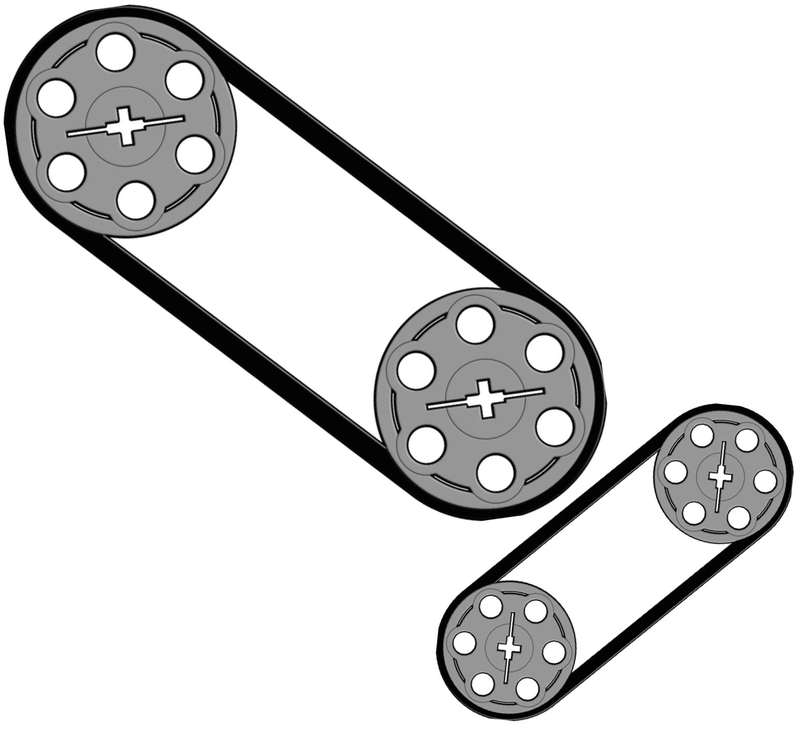
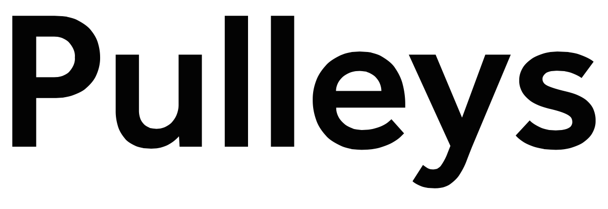

# THIS PROJECT IS DEPRECATED
pulleys is no longer maintained, and **this** repository will be removed from GitHub on or after Thursday, January 26, 2017. Published release artifacts will **continue** to be available via Github until that time.

 

Pulleys - An executable implementation of Harel Statecharts for the JVM
=======================================================================
If your domain requires complex, reactive or highly variant state models that can't cleanly be implemented as FSAs, 
Pulleys might be right for you. Originally developed by [CommerceHub](commercehub.com) as a means of implementing
workflow specific state machines for the drop ship order fulfillment domain, Pulleys provide a means of constructing 
executable state machines based on Statecharts models in either code or configuration.

Statecharts are a visual formalism of state machines that have been incorporated into the UML. They provide a number of 
benefits beyond FSAs in that they provide a language for describing concurrent states, hierarchical states and 
sub-states that need to preserve their previous state on exit in case of re-entry, for example a light switch with a 
dimmer.

Read more about Statecharts [here](http://www.wisdom.weizmann.ac.il/~dharel/SCANNED.PAPERS/Statecharts.pdf).

Modeling stateful systems via Statecharts is beneficial because it helps business analysts and developers describe 
behavior in a shared language. It's also possible to refactor state models to reduce complexity or introduce uniformity 
across business practices. And of course the value of an executable model is that anybody who can build the model should
be able to adapt it for production use.

##Pulleys implements the following features of Statecharts:##

* Concurrent states

* Exclusive states

* Hierarchical state with sub-states

* Default states

* History (A record of which states of a sub-state were active prior to transitioning out)

* Deep history (History across an entire sub-machine)

* Triggers

* Transitions including self transitions

* Entry/Exit/Transition actions
 
##Pulleys extends Statecharts in the following ways:##

* State cookies, a means of injecting state into a machine and extracting state from it. Used to decouple
stateful objects from state machine implementations as well as providing a means of state persistence

* Type-based trigger evaluation

* Conditional triggers, in which a trigger also contains a set of external conditions (such as the state of a related
state machine) which are compared to an expression written in a basic condition grammar as part of a trigger evaluation

* State rankings, used to determine how to react to a trigger that might cause transition in several similar stateful 
objects (such as partial fulfillment of a quantity of ordered goods)

* State labels, a specialization of Actions that allow a complex state machine to set labels approximating an FSA
along any dimension.

* Trigger maps, which allow a deterministic way to specify the order in which transitions should be evaluated in 
response to a trigger that may affect more than one state.

* Parameter maps, which offer a means of describing to consumers of a state machine what labels might be seen, even if
the machine wouldn't ever allow them in its current form

* Three levels of trigger applicability testing: applicable, viable and supported

* State to status mapping, allowing a state machine to be lazily constructed from a legacy FSA.
 
##Pulleys does not yet implement the following:##

 * Overlapping state machines

 * Parameterized states

 * Activities (asynchronous actions)

 * Delays and timeouts (though these can easily be implemented as Triggers and Actions)
 
 
    Note: if Pulleys feels like code written in 2005, that's because it was. This initial public release of Pulleys is 
    intended as a technology demo which will be extended, simplified and re-written over the coming months. Our intent 
    is to provide a powerful point of inflection for building reactive, stateful event driven systems

Happy hacking.

Matthew Mark Miller <m3@dasmb.com>
